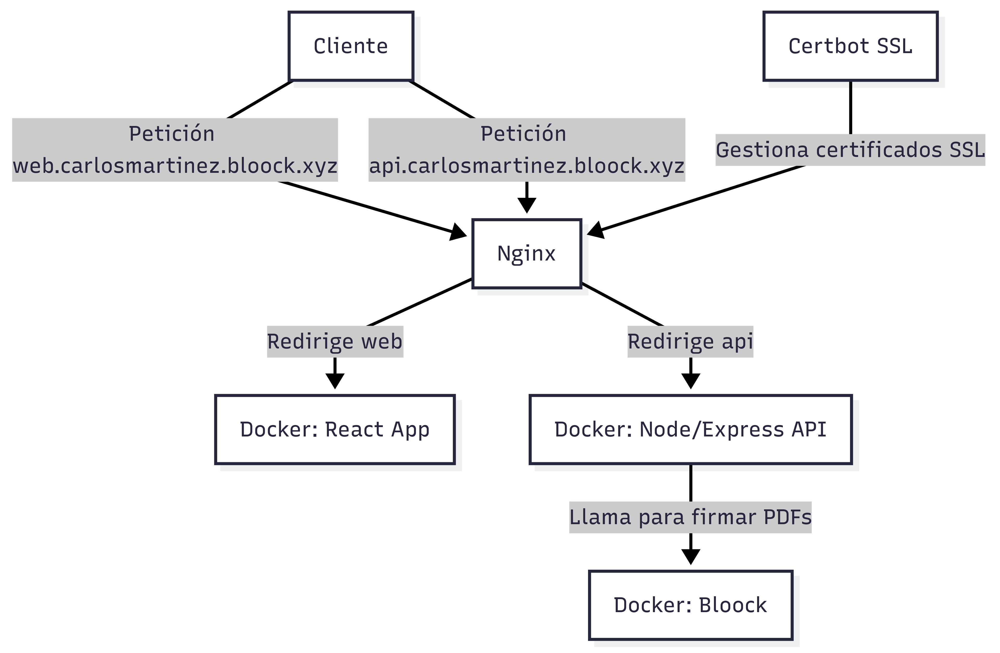

# Arquitectura del servidor
Este proyecto está desplegado en un servidor que ejecuta varios servicios mediante Docker y está gestionado por Nginx como proxy inverso con soporte SSL a través de Certbot.

## Servicios Docker
En el servidor se ejecutan dos contenedores Docker principales:

- **web**: Es la aplicación frontend desarrollada con React. Escucha en localhost a través del puerto 3000 y redirige al puerto 80.
- **api**: Backend construido con Node.js y Express que proporciona la API para la aplicación. Escucha en localhost a través del puerto 3500 y redirige al puerto 80.
- **bloock**: Servicio que se encarga de firmar y certificar los PDFs generados. La API se comunica con este contenedor para gestionar la firma y certificación de documentos PDF. Escucha en localhost a través del puerto 8080 y redirige al puerto 8080.

## Comunicación interna entre contenedores
La API se comunica internamente con el contenedor de Bloock para realizar operaciones de firma y certificación de PDFs. Esta comunicación ocurre dentro del entorno Docker, sin pasar por Nginx ni el exterior.

## Proxy inverso con Nginx
Nginx está instalado en el servidor para gestionar las peticiones entrantes y redirigirlas al servicio adecuado según el dominio utilizado:

- Cuando un usuario accede a **web.carlosmartinez.bloock.xyz**, Nginx redirige la petición al contenedor Docker que sirve la aplicación React (web).
- Cuando un usuario accede a **api.carlosmartinez.bloock.xyz**, Nginx redirige la petición al contenedor Docker que ejecuta la API de Node/Express (api).

## Certificados SSL con Certbot
Para asegurar la comunicación, el servidor utiliza Certbot para obtener y renovar automáticamente certificados SSL de Let's Encrypt. Nginx está configurado para usar estos certificados, garantizando que todas las conexiones a ambos dominios sean seguras mediante HTTPS.